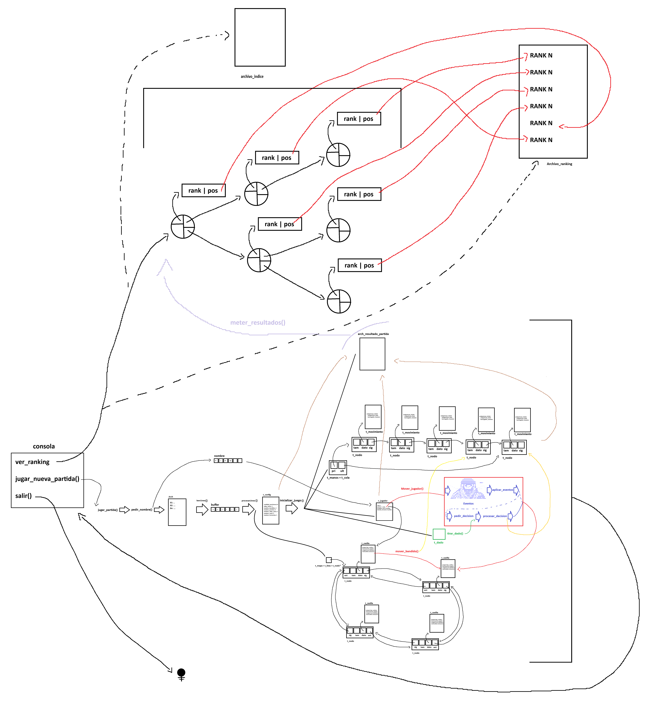
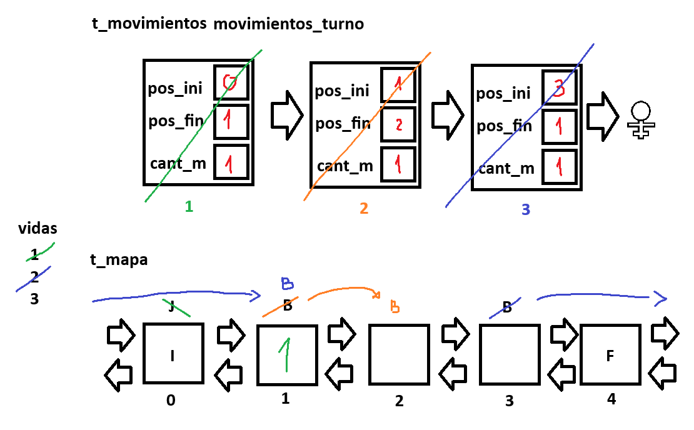

# Caravana del Desierto - AyED


Este repositorio es una implementación en C de un juego interactivo de consola llamado "Caravana del Desierto", donde los jugadores emprenden una peligrosa travesía por las arenas del desierto.

El juego es una simulación basada en casilleros por los cuales el jugador se va desplazando. La travesía en el tablero está determinada por las siguientes reglas:

* Un jugador que cae en un oasis recupera ventaja, pausando los malos tiempos del viaje y el ataque de los bandidos.

* Un jugador atrapado en una tormenta de arena sufre debe refugiarse por al menos un turno.

* Un jugador asaltado por bandidos pierde vidas si estos lo alcanzan y lo fuerzan a reemprender el viaje desde el inicio.

* Casilleros con premios y vidas extra aumentan la puntuación final y las probabilidades de éxito.

## Tabla de Contenidos

* [Descripción del Proyecto](#descripción-del-proyecto)

* [Instrucciones de Uso](#instrucciones-de-uso)

* [Integrantes](#integrantes)

## Descripción del Proyecto

### Diseño y Arquitectura



Este proyecto está codificado integramente en C y construye un motor de juego utilizando diferentes estructuras de datos para modelar los comportamientos del juego.

La **configuracion inicial** del mapa se carga a partir de un [archivo de configuración](#archivos-de-configuración) bien formado (En caso de no estarlo, se sustituyen valores erroneos por los de por defecto) que genera una estructura llamada t\_config desde la cual se generá el mapa.

Se utiliza una **Lista Circular Doble** para la representación de los casilleros del mapa. El accionar de los bandidos y del jugador se ejecutan almacenando sus distintas acciones en una **Cola Dinámica** y los casilleros resultantes se generan a partir de el desacolo ordenado de estos movimientos. El jugador tiene en su estructura un atributo tipo unsigned como indice de su posicion en el mapa. Cada casillero tiene en sus atributos la cantidad de bandidos presentes en esa casilla y si el jugador esta presente o no (Los bandidos se manejan como atributos de los casilleros y no entidades propias).



Tiene un sistema de ranking implementado como un **indice** sobre un **arbol binario** que retiene la informacion de los jugadores y, relacionandolo los datos de partidas cargados y ordenados dentro de una **lista enlazada simple.**, calcula el top 5 mejores jugadores.

### Notacion del mapa/caravana.txt

Para la visualización y exportación del estado del mapa, el proyecto utiliza una notación compacta estructurada por casilleros. Cada casillero se representa de forma individual siguiendo un formato específico que resume sus propiedades principales.

Cada casillero se imprime con la siguiente estructura:

`[Posición|Tipo|Jugador|Bandidos]`


| Campo        | Formato / Valores                 | Descripción                                                                         |
| :----------- | :-------------------------------- | :---------------------------------------------------------------------------------- |
| **Posición** | `00` al `99` (Dos dígitos)        | El número identificador de la posición del casillero (`nro_posicion`).              |
| **Tipo**     | `I`, `F`, `O`, `T`, `V`, `P`, `.` | La inicial del tipo de terreno o evento del casillero (Ver *Referencias de Tipos*). |
| **Jugador**  | `J` o `.`                         | Indica si hay un jugador presente (`J`) o si está vacío (`.`).                      |
| **Bandidos** | `B:X` (Donde X es un número)      | Indica la cantidad de bandidos presentes en ese casillero.                          |

***

### Referencias de Tipos de Casillero

El segundo parámetro (`Tipo`) varía según las constantes definidas en el juego:

* **`I`** : **Inicio** (`TIPO_INICIO`) — Punto de partida de la caravana.

* **`F`** : **Fin** (`TIPO_FIN`) — Meta.

* **`O`** : **Oasis** (`TIPO_OASIS`) — Zona de descanso que protege durante un turno.

* **`T`** : **Tormenta** (`TIPO_TORMENTA`) — Tormenta que hace perder el turno.

* **`V`** : **Vida Extra** (`TIPO_VIDA_EXTRA`) — Vida extra.

* **`P`** : **Premio** (`TIPO_PREMIO`) — Punto extra.

* **`.`** : **Casillero Estándar** (`default`) — Terreno neutral sin eventos especiales.

## Instrucciones de Uso

### Archivos de Configuración

Antes de iniciar, puede modificar/agregar el archivo de texto `config.txt` que debe encontrarse en el mismo directorio que el ejecutable. Su formato debe ser similar a este:

```text
cantidad_posiciones:25
vidas_inicio:3
maximo_bandidos:2
maximo_premios:3
maximo_vidas_extra:1
maximo_oasis:2
maximo_tormentas:3
```

*(Si no se encuentra el archivo* *`config.txt`, el motor cargará estos valores por defecto).*

### Utilizar

Para usar el programa, debe abrir una consola de comandos donde se encuentre el binario compilado y ejecutarlo:

```bash
Caravana_del_Desierto.exe
```

1. Seleccione la opción númerica en el menú principal.
2. Elija "Jugar nueva partida" para comenzar o "Ver ranking" para leer el historial de puntajes, el cual es deserializado del archivo binario integrado.
3. Siga las instrucciones en pantalla y presione la tecla indicada para lanzar el dado.

## Integrantes

* Gauto, Gastón

* Lazarte, Ulises

* Valentín, Nievas

* Divano, Matías

* Cornara, Tomás
